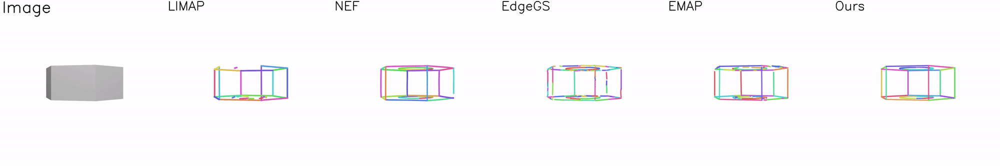
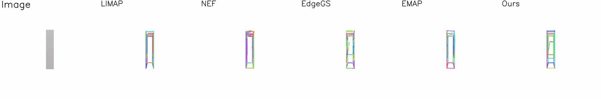

# [ICCV 2025] CurveGaussian

<h2 align="center">

Curve-Aware Gaussian Splatting for 3D Parametric Curve Reconstruction

[Zhirui Gao](https://scholar.google.com/citations?user=IqtwGzYAAAAJ&hl=zh-CN), [Renjiao Yi](https://renjiaoyi.github.io/), Yaqiao Dai, Xuening Zhu, [Wei Chen](https://openreview.net/profile?id=~Wei_Chen35),  [Chenyang Zhu](https://www.zhuchenyang.net/), [Kai Xu](https://kevinkaixu.net/)

[](https://arxiv.org/abs/2506.21401)
[](https://zhirui-gao.github.io/CurveGaussian/)
[](https://zhirui-gao.github.io/CurveGaussian/)

<p>
    
</p>

<p align="center">
<span style="font-size: 16px">
CurveGaussian enables compact 3D parametric curve reconstruction from multi-view 2D edge maps.  
</span>
</p>


<p>
    
</p>

</h4>

This repository contains the official implementation of the paper: [Curve-Aware Gaussian Splatting for 3D Parametric Curve Reconstruction](https://arxiv.org/abs/2506.21401), which is accepted to ICCV 2025.
CurveGaussian is a novel bi-directional coupling framework
between parametric curves and edge-oriented Gaussian
components, enabling direct optimization of parametric
curves through differentiable Gaussian splatting.

If you find this repository useful to your research or work, it is really appreciated to star this repository✨ and cite our paper 📚.

Feel free to contact me (gzrer2018@gmail.com) or open an issue if you have any questions or suggestions.


## 🔥 See Also

You may also be interested in our other works:
- [**[ICCV 2025] PartGS**](https://github.com/zhirui-gao/PartGS):  A self-supervised part-aware reconstruction framework that integrates 2D Gaussians and superquadrics to parse objects and scenes into an interpretable decomposition.

- [**[TCSVT 2025] PoseProbe**](https://github.com/zhirui-gao/PoseProbe): A novel approach of utilizing everyday objects commonly found in both images and real life, as pose probes, to tackle few-view NeRF reconstruction using only 3 to 6 unposed scene images.


- [**[CVMJ 2024] DeepTm**](https://github.com/zhirui-gao/Deep-Template-Matching): An accurate template matching method based on differentiable coarse-to-fine correspondence refinement, especially designed for planar industrial parts.


## 📢 News
- **2025-06-27**: The paper is available on arXiv.
- **2025-06-26**: CurveGaussian is accepted to ICCV 2025. 🎉


## 📋 TODO

- [x] Release the training and evaluation code.
- [x] Evaluation and visulization code.
- [ ] Custom dataset support.


## 🔧 Installation

```
git clone --recurse-submodules https://github.com/zhirui-gao/Curve-Gaussian.git
```
Our code environment list similar to 3DGS

We make a custom rasterization libariry(diff-cur-rasterization) based on orginal [diff-gaussian-rasterization](https://github.com/graphdeco-inria/gaussian-splatting).

If you have a environment for 3DGS, you just run
```
pip install  submodules/diff-cur-rasterization
```
Otherwise, you sholud creat a new conda environment:

```
conda env create --file environment.yml
conda activate gaussian_splatting
```


## 📊 Dataset

We use the dataset provided by [EMAP](https://github.com/cvg/EMAP/blob/main/scripts/download_data.py).

Download datasets:
```
python scripts/download_data.py 
```


The data is organized as follows:
```
<scan_id>
|-- meta_data.json      # camera parameters
|-- color               # images for each view
    |-- 0_colors.png
    |-- 1_colors.png
    ...
|-- edge_DexiNed        # edge maps extracted from DexiNed
    |-- 0_colors.png
    |-- 1_colors.png
    ...
|-- edge_PidiNet        # edge maps extracted from PidiNet
    |-- 0_colors.png
    |-- 1_colors.png
    ...
```

## 🚀 Training 

### ABC-dataset

Run a single dataset

```
python train.py -s /media/gzr/ABC-NEF_Edge/data/00000168 -m output/00000168  -r 2 --eval  --quiet
```

Run the whole dataset

```
python scripts/run_batch_ABC.py
```

### Replicat-dataset

set arguments/__init__.py
```
self.detector = 'PidiNet'  
```

```
bash scripts/run_replica.sh
```


## 👊 Evaluation

### ABC-dataset
```
python edge_extraction/eval_ABC.py
```

If you want to render a continuous video of parametric curve:

First download [camera poses files](https://drive.google.com/file/d/1izmZaDlJc_JDkndBTYqCpjYlwReEEilw/view?usp=sharing) for projection, and organize the dataset as follows

```
<scan_id>
|-- meta_data.json      # camera parameters
|-- transforms_video.json   # continuous camera parameters
|-- video  # gt images under continuous camera parameters
```

Then just run the commond:
```
python edge_extraction/eval_ABC.py --render_mv True
```

### Replica-dataset

```
python edge_extraction/eval_replica.py
```
This is only for calculating the number of curves and visualization since GT curves are not availabel.


## 👀 Visual Results


### ABC-NEF Dataset
<p align="center">
    
    
    

</p>

### Replica Dataset 

<p align="center">
    
    
</p>


## 📚 Citation
If you find our work helpful, please consider citing:
```bibtex
@misc{gao2025curveawaregaussiansplatting3d,
      title={Curve-Aware Gaussian Splatting for 3D Parametric Curve Reconstruction}, 
      author={Zhirui Gao and Renjiao Yi and Yaqiao Dai and Xuening Zhu and Wei Chen and Chenyang Zhu and Kai Xu},
      year={2025},
      eprint={2506.21401},
      archivePrefix={arXiv},
      primaryClass={cs.CV},
      url={https://arxiv.org/abs/2506.21401}, 
}
```

<!-- ## Contact
If you encounter any issues, you can also contact Gao through gzrer2018@gmail.com. -->


## Acknowledgement
This project is built upon [3DGS](https://github.com/graphdeco-inria/gaussian-splatting), [EMAP](https://github.com/cvg/EMAP) and [NEF](https://github.com/yunfan1202/NEF_code). We use pretrained [DexiNed](https://github.com/xavysp/DexiNed) and [PidiNet](https://github.com/hellozhuo/pidinet) for edge map extraction. We thank all the authors for their great work and repos.